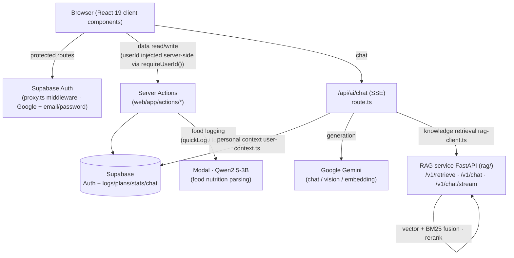

# FitCore

FitCore is an AI-powered fitness and nutrition app that makes food logging easier and gives users context-aware coaching. It combines a Next.js frontend, a FastAPI retrieval service, Supabase data and authentication, and AI models for chat and nutrition extraction.

**Live app:** [fitcore-web-eight.vercel.app](https://fitcore-web-eight.vercel.app/) (sign-in required)

## What it does

- Logs food from natural-language descriptions, voice transcripts, and photos.
- Brings nutrition and training records into a mobile-first daily view.
- Grounds coaching answers with a retrieval pipeline that combines vector search and BM25, with optional reranking.

## Explore the code

- [`web/`](./web) contains the Next.js app, authenticated user flows, food logging, and chat UI.
- [`rag/`](./rag) contains the FastAPI retrieval service.
- [`DEVELOPMENT.md`](./DEVELOPMENT.md) explains architecture, API contracts, ingestion, testing, and troubleshooting.

The frontend and backend are managed together in a single monorepo:

```
Fitcore/
├── web/   # Frontend: Next.js 16 (App Router) + React 19 + Supabase (Auth + data)
└── rag/   # Backend: FastAPI + LangChain RAG retrieval service (Google Gemini)
```

## Architecture



> Note: the frontend never talks to Supabase directly — all data access goes through Server Actions (`web/lib/supabaseClient.ts` is `server-only` + service-role). The frontend calls the backend RAG service via `RAG_SERVICE_URL` (default `http://127.0.0.1:8000`).
>
> For the full development guide (architecture details, API contracts, ingestion, testing, troubleshooting), see [`DEVELOPMENT.md`](./DEVELOPMENT.md).

### Mobile-first UX principle

FitCore is designed as a phone app first. **Every main page must fit entirely inside one phone viewport without vertical scrolling.** Cards show only the highest-priority summary; longer lists, charts, and detailed editors live behind taps that open full-screen sheets. Cards themselves may be internally scrollable, but the main page scroll is avoided.

## Subprojects

| Directory | Description | Docs |
|------|------|------|
| [`web/`](./web) | Frontend single-page app; the home route `/` contains two tabs: **Today / Record** (Today = daily command center with Quick Log + AI coach; Record = past nutrition + training under one shared date, with 7-day trend charts). The app is **AI-logging-first**: the fastest path from "I want to log this" to "it's logged" is the protagonist; the AI coach is a secondary, conversational surface for evidence-grounded Q&A and plan authoring. | [`web/README.md`](./web/README.md) |
| [`rag/`](./rag) | RAG retrieval service: vector retrieval + BM25 fusion, optional reranking, adaptive topK | [`DEVELOPMENT.md`](./DEVELOPMENT.md) |

## Local setup

### 1. Backend RAG service (rag/)

```bash
cd rag
python -m venv .venv
.venv/Scripts/pip install -r requirements-dev.txt   # Windows
# source .venv/bin/activate && pip install -r requirements-dev.txt  # macOS/Linux

cp .env.example .env          # at minimum set GOOGLE_AI_STUDIO_API_KEY
python scripts/ingest_seed_kb.py   # ingest the seed knowledge base (first run)
uvicorn backend_api:app --host 0.0.0.0 --port 8000
```

### 2. Frontend (web/)

```bash
cd web
cp .env.local.example .env.local   # configure Supabase / RAG_SERVICE_URL, etc.
npm install
npm run dev
```

Open http://localhost:3000 to use the app.

## Deployment

In the monorepo the frontend and backend deploy independently:

### Frontend → Vercel

When creating/linking a project on Vercel, set the **Root Directory** to `web` (Settings → General → Root Directory).
Everything else follows Next.js defaults; for environment variables see `web/.env.local.example`.

### Backend → Render

The repo root already has `render.yaml` (a Blueprint) whose `rootDir: rag` points at the backend subdirectory.
Connect this repo on Render using the **Blueprint** flow and it will be detected automatically;
secrets marked `sync: false` (`GOOGLE_AI_STUDIO_API_KEY`, `SUPABASE_*`, `UPSTASH_*`, etc.) are entered manually in the Render Dashboard.

> The frontend's `RAG_SERVICE_URL` must point at the public address of the backend service on Render.

## Tech stack

- **Frontend**: Next.js 16, React 19, TypeScript, Tailwind CSS 4, shadcn/ui, Supabase (Auth + data)
- **AI models**: Google Gemini (gemini-2.5-flash — chat, vision, embeddings) + Qwen2.5-3B fine-tuned for food nutrition parsing (Modal serverless)
- **Backend**: Python 3.11, FastAPI, LangChain 1.x, Chroma / Supabase pgvector
