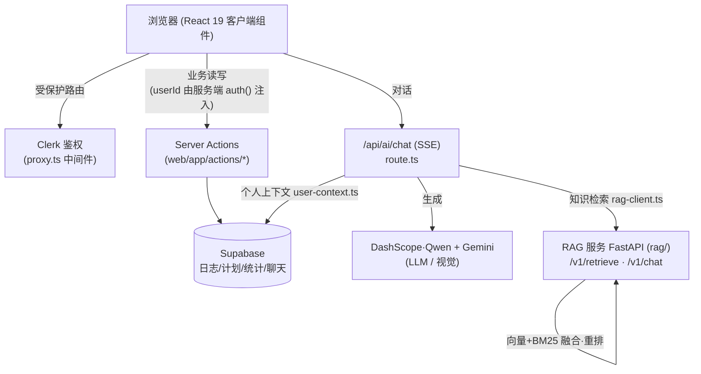

# FitCore

AI 驱动的健身教练应用。前后端合并为一个 monorepo 管理：

```
Fitcore/
├── web/   # 前端：Next.js 16 (App Router) + React 19 + Clerk + Supabase
└── rag/   # 后端：FastAPI + LangChain RAG 检索服务（DashScope/Qwen）
```

## 整体架构



> 说明：前端不直连 Supabase——所有数据访问都走 Server Actions（`web/lib/supabaseClient.ts` 是 `server-only` + service-role）。前端通过 `RAG_SERVICE_URL`（默认 `http://127.0.0.1:8000`）调用后端 RAG 服务。

> 完整的开发指南（架构细节、接口契约、灌库、测试、排错）见 [`DEVELOPMENT.md`](./DEVELOPMENT.md)。

## 子项目

| 目录 | 说明 | 文档 |
|------|------|------|
| [`web/`](./web) | 前端单页应用，主页 `/` 内含「今日概览 / 饮食中心 / 训练历史 / 我的计划 / 知识库」五个模块 | [`web/README.md`](./web/README.md) |
| [`rag/`](./rag) | RAG 检索服务：向量检索 + BM25 融合，可选重排，自适应 topK | [`DEVELOPMENT.md`](./DEVELOPMENT.md) |

## 本地启动

### 1. 后端 RAG 服务（rag/）

```bash
cd rag
python -m venv .venv
.venv/Scripts/pip install -r requirements-dev.txt   # Windows
# source .venv/bin/activate && pip install -r requirements-dev.txt  # macOS/Linux

cp .env.example .env          # 至少配置 DASHSCOPE_API_KEY
python scripts/ingest_seed_kb.py   # 灌入种子知识库（首次）
uvicorn backend_api:app --host 0.0.0.0 --port 8000
```

### 2. 前端（web/）

```bash
cd web
cp .env.local.example .env.local   # 配置 Clerk / Supabase / RAG_SERVICE_URL 等
npm install
npm run dev
```

打开 http://localhost:3000 即可访问。

## 部署

monorepo 下前后端分别部署，互不干扰：

### 前端 → Vercel

在 Vercel 新建/关联项目时，将 **Root Directory** 设为 `web`（Settings → General → Root Directory）。
其余按 Next.js 默认即可，环境变量参考 `web/.env.local.example`。

### 后端 → Render

仓库根目录已有 `render.yaml`（Blueprint），其中 `rootDir: rag` 指向后端子目录。
在 Render 用 **Blueprint** 方式连接本仓库即可自动识别；
标记为 `sync: false` 的密钥（`DASHSCOPE_API_KEY`、`SUPABASE_*`、`UPSTASH_*` 等）在 Render Dashboard 手动填写。

> 前端的 `RAG_SERVICE_URL` 需指向 Render 上后端服务的公网地址。

## 技术栈

- **前端**：Next.js 16、React 19、TypeScript、Tailwind CSS 4、shadcn/ui、Clerk、Supabase
- **后端**：Python 3.11、FastAPI、LangChain 1.x、DashScope（Qwen + text-embedding-v4）、Chroma / Supabase pgvector
