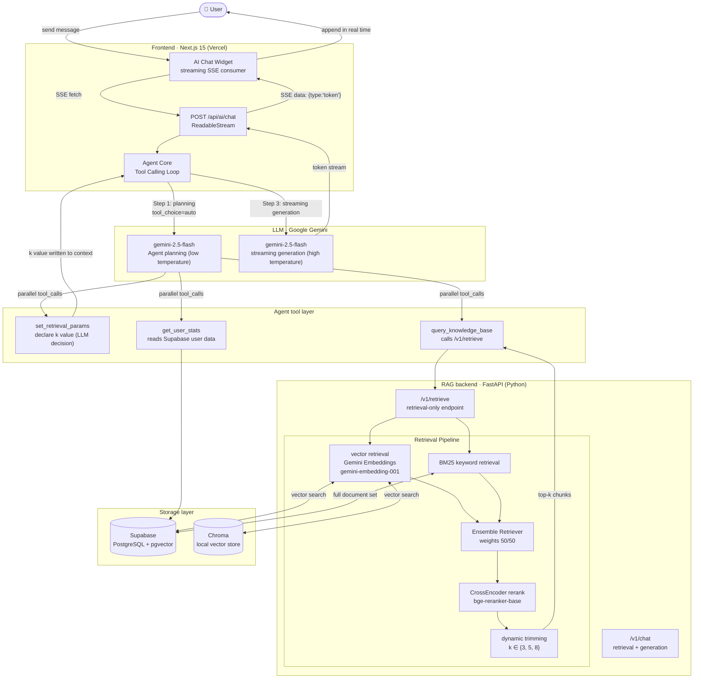

# FitCore — AI-Powered Fitness Coaching Platform

> A full-stack AI fitness coaching platform built on RAG + Agent Tool Calling

**Live Demo:** [fitcore-web-eight.vercel.app](https://fitcore-web-eight.vercel.app/)

---

## Architecture



---

## Tech Stack

| Layer | Technology |
|---|---|
| **Frontend framework** | Next.js 15 · React 19 · TypeScript |
| **UI / styling** | Tailwind CSS 4 · Radix UI · shadcn/ui |
| **Authentication** | Supabase Auth (Google OAuth + email/password) |
| **Backend framework** | FastAPI · Uvicorn (Python) |
| **RAG framework** | LangChain 1.2 · LangChain Community |
| **Vector database** | Supabase pgvector (production) · Chroma (local) |
| **Embedding model** | Gemini gemini-embedding-001 (default 768 dims, tunable via EMBEDDING_DIM) |
| **Chat model** | Google Gemini (default gemini-2.5-flash, switchable via environment variable) through an OpenAI-compatible endpoint |
| **Reranking** | HuggingFace CrossEncoder (bge-reranker-base) |
| **Database** | Supabase PostgreSQL |
| **Deployment** | Vercel (frontend) · self-hosted server (RAG backend) |

---

## Key Features

### 🤖 Agent + Tool Calling
Instead of traditional keyword/rule-based classification, the LLM autonomously decides which tools to call:

- `set_retrieval_params` — the LLM declares how many results to retrieve, k (3 / 5 / 8), based on question complexity
- `query_knowledge_base` — calls the RAG retrieval endpoint to fetch professional fitness knowledge
- `get_user_stats` — reads the user's nutrition / workout / goal data for today

Complex questions (e.g. "the difference between squats and deadlifts and how to combine them into a training plan") → the LLM calls all three tools at once, with only 2 LLM API calls in total.

### ⚡ Streaming output (SSE)
The API route returns a `ReadableStream`, and the Chat Widget appends tokens one by one, with a time-to-first-token under 1s.

### 📚 Hybrid retrieval RAG pipeline
```
vector retrieval (k=10)  +  BM25 keyword retrieval (k=10)
          ↓ Ensemble (50/50)
     CrossEncoder rerank
          ↓ dynamic trimming (k decided by the LLM)
       final context chunks
```

### 📊 RAG evaluation framework
A golden test set of 15 questions covering different difficulty levels and topics, evaluated with the LLM-as-Judge method:
- **Relevance** — whether the answer is on topic
- **Completeness** — whether it covers the key information
- **Accuracy** — whether the content matches professional knowledge

### 💾 Data tracking
- Daily calories / protein / carbs / fat / water logging
- Training plan management (drag-and-drop ordering)
- Persisted multi-turn conversation history

---

## RAG Evaluation Results

> How to run: `cd Rag && python eval/evaluate.py` (start the RAG backend first)

| Metric | Score |
|---|---|
| **Average relevance** | `1.000` |
| **Average completeness** | `0.853` |
| **Average accuracy** | `1.000` |
| **Average latency** | `17586 ms` |
| **Average number of citations** | `3.0` |

*After running the evaluation, fill the table above with the summary values from `eval/eval_report_*.json`.*

---

## Project Structure

```
Fitcore/
├── fitcore-web/                # Next.js frontend
│   ├── app/
│   │   └── api/ai/chat/        # SSE streaming API route
│   ├── components/
│   │   └── ai-chat-widget.tsx  # streaming Chat UI
│   └── lib/ai/
│       ├── agent.ts            # Agent core (Tool Calling Loop)
│       ├── rag-client.ts       # RAG service client
│       └── types.ts            # type definitions
│
└── Rag/                        # Python RAG backend
    ├── backend_api.py          # FastAPI routes (/v1/chat · /v1/retrieve)
    ├── rag.py                  # RagService + compute_retrieval_k
    ├── vector_stores.py        # Chroma hybrid retrieval
    ├── vector_stores_supabase.py
    ├── knowledge_base.py       # knowledge base management
    └── eval/
        ├── golden_dataset.json # 15-question evaluation test set
        └── evaluate.py         # LLM-as-Judge evaluation script
```

---

## Quick Start

### Frontend

```bash
cd fitcore-web
cp .env.local.example .env.local   # fill in Supabase / Gemini key
npm install
npm run dev
```

### RAG backend

```bash
cd Rag
cp .env.example .env               # fill in GOOGLE_AI_STUDIO_API_KEY, etc.
pip install -r requirements.txt
python backend_api.py              # starts on :8000
```

### Running the RAG evaluation

```bash
# after the backend is started:
cd Rag
python eval/evaluate.py
# outputs eval/eval_report_<timestamp>.json
```

---

## Environment Variables

### Frontend (`fitcore-web/.env.local`)

```env
NEXT_PUBLIC_SUPABASE_URL=
NEXT_PUBLIC_SUPABASE_ANON_KEY=   # public key, used by the cookie session client (sign-in/sign-up/Google OAuth)
SUPABASE_SERVICE_ROLE_KEY=   # server-side only (server actions + middleware), bypasses RLS, must never be exposed to the browser
GOOGLE_AI_STUDIO_API_KEY=    # a single Gemini key covers all AI features: chat / parsing / vision
AI_CHAT_MODEL=gemini-2.5-flash
AI_FAST_MODEL=gemini-2.5-flash
GEMINI_VISION_MODEL=gemini-2.5-flash
RAG_SERVICE_URL=http://your-rag-server:8000
# Optional: point at another OpenAI-compatible provider (overrides the Gemini default when set)
# OPENAI_API_KEY=
# OPENAI_BASE_URL=
```

### RAG backend (`Rag/.env`)

```env
GOOGLE_AI_STUDIO_API_KEY=        # Gemini key (shared by chat + embedding)
RAG_CHAT_MODEL=gemini-2.5-flash
EMBEDDING_MODEL=models/gemini-embedding-001
EMBEDDING_DIM=768                # must match the vector(N) in the Supabase migration
VECTOR_BACKEND=supabase          # or chroma
SUPABASE_URL=
SUPABASE_SERVICE_ROLE_KEY=
RERANKER_ENABLED=true
RERANKER_MODEL_NAME=             # HuggingFace model id, or leave empty to use a local path
EVAL_JUDGE_MODEL=gemini-2.5-flash
```
